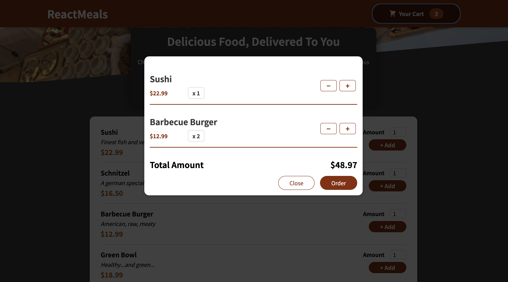

# FoodiePal: Your Ultimate Food Ordering App

Welcome to FoodiePal, your go-to food ordering app built with React, JavaScript, and CSS. With FoodiePal, you can explore a delectable menu, add your favorite items to the cart, and savor a hassle-free dining experience.

<strong>Experience the application live <a href="https://food-ordering-app-8716ec2a470f.herokuapp.com/"><b>here</b></a>.</strong>

## Features

- **Interactive Menu:** Browse through a diverse range of mouthwatering dishes on the menu.
- **Cart Management:** Easily add multiple items to your cart, adjusting quantities as desired.
- **Total Calculation:** As you build your order, watch the app dynamically calculate the final total amount.
- **Cart Preview:** Clicking on the cart icon presents you with a comprehensive view of your selected items and the total cost.

Enjoy a delightful culinary journey with FoodiePal! If you encounter any questions or require assistance, don't hesitate to reach out.

Bon appétit! 🍔🍕🥗

## About Me
Hello, I'm Mauro Leos, a dedicated Software Engineer who's passionate about creating practical solutions. FoodiePal is a testament to my commitment to crafting user-friendly applications that make financial tracking a breeze.

## Get in Touch
Connect with me on <a href="https://www.linkedin.com/in/mauro-leos-b4103a11b/">LinkedIn</a>.
